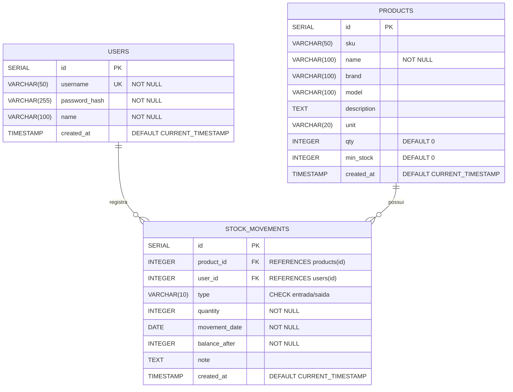

# 📊 DER - Diagrama de Entidade-Relacionamento
## Sistema de Gestão de Cantina Escolar

---

## 🎨 Diagrama Visual (Mermaid)



---

## 📋 Descrição das Entidades

### 1️⃣ **USERS** (Usuários)
**Descrição:** Armazena os usuários do sistema com suas credenciais de acesso.

| Campo | Tipo | Restrições | Descrição |
|-------|------|------------|-----------|
| `id` | SERIAL | PRIMARY KEY | Identificador único do usuário |
| `username` | VARCHAR(50) | UNIQUE, NOT NULL | Nome de usuário para login |
| `password_hash` | VARCHAR(255) | NOT NULL | Senha do usuário (hash) |
| `name` | VARCHAR(100) | NOT NULL | Nome completo do usuário |
| `created_at` | TIMESTAMP | DEFAULT NOW() | Data de criação do registro |

**Relacionamentos:**
- Um usuário pode registrar **várias movimentações** (1:N)

---

### 2️⃣ **PRODUCTS** (Produtos)
**Descrição:** Cadastro de produtos disponíveis no estoque da cantina.

| Campo | Tipo | Restrições | Descrição |
|-------|------|------------|-----------|
| `id` | SERIAL | PRIMARY KEY | Identificador único do produto |
| `sku` | VARCHAR(50) | - | Código SKU do produto |
| `name` | VARCHAR(100) | NOT NULL | Nome do produto |
| `brand` | VARCHAR(100) | - | Marca/fabricante |
| `model` | VARCHAR(100) | - | Modelo específico |
| `description` | TEXT | - | Descrição detalhada |
| `unit` | VARCHAR(20) | - | Unidade de medida (Un, Kg, L, Cx) |
| `qty` | INTEGER | DEFAULT 0 | Quantidade em estoque |
| `min_stock` | INTEGER | DEFAULT 0 | Estoque mínimo (alerta) |
| `created_at` | TIMESTAMP | DEFAULT NOW() | Data de cadastro |

**Relacionamentos:**
- Um produto pode ter **várias movimentações** (1:N)

**Regras de Negócio:**
- `qty < min_stock` → Produto aparece no alerta de estoque baixo
- `name` é obrigatório para cadastro

---

### 3️⃣ **STOCK_MOVEMENTS** (Movimentações de Estoque)
**Descrição:** Registra todas as entradas e saídas de produtos no estoque.

| Campo | Tipo | Restrições | Descrição |
|-------|------|------------|-----------|
| `id` | SERIAL | PRIMARY KEY | Identificador único da movimentação |
| `product_id` | INTEGER | FK → products(id), ON DELETE CASCADE | Produto movimentado |
| `user_id` | INTEGER | FK → users(id) | Usuário que registrou |
| `type` | VARCHAR(10) | CHECK ('entrada', 'saida') | Tipo de movimentação |
| `quantity` | INTEGER | NOT NULL | Quantidade movimentada |
| `movement_date` | DATE | NOT NULL | Data da movimentação |
| `balance_after` | INTEGER | NOT NULL | Saldo após a operação |
| `note` | TEXT | - | Observações adicionais |
| `created_at` | TIMESTAMP | DEFAULT NOW() | Data do registro |

**Relacionamentos:**
- Cada movimentação pertence a **um produto** (N:1)
- Cada movimentação é registrada por **um usuário** (N:1)

**Regras de Negócio:**
- `type = 'entrada'` → Aumenta o estoque
- `type = 'saida'` → Diminui o estoque
- Não permite saída maior que o estoque disponível
- `ON DELETE CASCADE` → Se o produto for excluído, suas movimentações também são

---

## 🔗 Relacionamentos

### **USERS → STOCK_MOVEMENTS** (1:N)
- **Cardinalidade:** Um usuário pode registrar várias movimentações
- **Tipo:** Relacionamento identificador parcial
- **Chave Estrangeira:** `stock_movements.user_id` → `users.id`
- **Regra:** Um usuário pode ter 0 ou N movimentações registradas

### **PRODUCTS → STOCK_MOVEMENTS** (1:N)
- **Cardinalidade:** Um produto pode ter várias movimentações
- **Tipo:** Relacionamento forte com deleção em cascata
- **Chave Estrangeira:** `stock_movements.product_id` → `products.id`
- **Regra:** Ao excluir um produto, todas suas movimentações são excluídas
- **Constraint:** `ON DELETE CASCADE`

---

## 🎯 Diagrama Simplificado (Notação Crow's Foot)

```
┌─────────────────┐
│     USERS       │
├─────────────────┤
│ PK  id          │
│ UK  username    │
│     password    │
│     name        │
└────────┬────────┘
         │
         │ registra
         │ (1:N)
         │
         ▼
┌─────────────────────┐
│ STOCK_MOVEMENTS     │
├─────────────────────┤
│ PK  id              │
│ FK  product_id   ───┼───┐
│ FK  user_id         │   │
│     type            │   │
│     quantity        │   │
│     movement_date   │   │
│     balance_after   │   │
│     note            │   │
└─────────────────────┘   │
                          │
                          │ possui
                          │ (N:1)
                          │
                          ▼
                    ┌─────────────────┐
                    │   PRODUCTS      │
                    ├─────────────────┤
                    │ PK  id          │
                    │     sku         │
                    │     name        │
                    │     brand       │
                    │     model       │
                    │     description │
                    │     unit        │
                    │     qty         │
                    │     min_stock   │
                    └─────────────────┘
```

---

## 📊 Dicionário de Dados

### Chaves Primárias (PK)
- `users.id` → Identificador único de usuário
- `products.id` → Identificador único de produto
- `stock_movements.id` → Identificador único de movimentação

### Chaves Estrangeiras (FK)
- `stock_movements.product_id` → Referencia `products.id` (ON DELETE CASCADE)
- `stock_movements.user_id` → Referencia `users.id`

### Chaves Únicas (UK)
- `users.username` → Garante que não existam usuários duplicados

### Constraints de Verificação (CHECK)
- `stock_movements.type` → Deve ser 'entrada' ou 'saida'

---

## 🔐 Integridade Referencial

### Regras Implementadas:

1. **CASCADE DELETE** (Produtos → Movimentações)
   - Se um produto for excluído, todas suas movimentações são automaticamente removidas
   - `ON DELETE CASCADE` em `stock_movements.product_id`

2. **RESTRICT** (Usuários → Movimentações)
   - Não permite excluir um usuário que possui movimentações registradas
   - Comportamento padrão do PostgreSQL

3. **UNIQUE** (Username)
   - Não permite dois usuários com o mesmo username
   - Garante unicidade no login

4. **NOT NULL** (Campos Obrigatórios)
   - `users.username`, `users.password_hash`, `users.name`
   - `products.name`
   - `stock_movements.quantity`, `stock_movements.movement_date`, `stock_movements.balance_after`

---

## 📈 Índices (Otimização)

### Índices Automáticos (PRIMARY KEY):
- `users_pkey` em `users.id`
- `products_pkey` em `products.id`
- `stock_movements_pkey` em `stock_movements.id`

### Índices de Chave Estrangeira (recomendados):
```sql
CREATE INDEX idx_stock_movements_product_id ON stock_movements(product_id);
CREATE INDEX idx_stock_movements_user_id ON stock_movements(user_id);
CREATE INDEX idx_stock_movements_date ON stock_movements(movement_date);
```

---

## 🎨 Legenda de Notações

### Cardinalidade:
- `||` → Um (obrigatório)
- `|o` → Zero ou um
- `}o` → Zero ou muitos
- `}|` → Um ou muitos

### Relacionamentos:
- `1:1` → Um para um
- `1:N` → Um para muitos
- `N:N` → Muitos para muitos (não existe neste sistema)

---

## 💡 Observações Técnicas

### Vantagens do Design:
✅ **Normalização:** 3ª Forma Normal (3FN)  
✅ **Integridade:** Chaves estrangeiras garantem consistência  
✅ **Auditoria:** Registro completo de quem fez o quê e quando  
✅ **Histórico:** Mantém `balance_after` para rastreabilidade  
✅ **Flexibilidade:** Fácil adicionar campos sem quebrar estrutura  

### Possíveis Melhorias Futuras:
🔄 Adicionar tabela `categories` (categorias de produtos)  
🔄 Criar tabela `suppliers` (fornecedores)  
🔄 Implementar `permissions` (permissões de usuário)  
🔄 Adicionar `price` em produtos (valor monetário)  
🔄 Criar `orders` (pedidos/vendas completas)  

---

## 🚀 Scripts SQL para Validação

### Verificar Integridade:
```sql
-- Contar registros
SELECT 'users' AS tabela, COUNT(*) FROM users
UNION ALL
SELECT 'products', COUNT(*) FROM products
UNION ALL
SELECT 'stock_movements', COUNT(*) FROM stock_movements;

-- Verificar relacionamentos
SELECT 
    p.name AS produto,
    COUNT(sm.id) AS total_movimentacoes
FROM products p
LEFT JOIN stock_movements sm ON p.id = sm.product_id
GROUP BY p.id, p.name
ORDER BY total_movimentacoes DESC;

-- Produtos com estoque baixo
SELECT 
    name,
    qty AS estoque_atual,
    min_stock AS estoque_minimo,
    (min_stock - qty) AS deficit
FROM products
WHERE qty < min_stock AND min_stock > 0
ORDER BY deficit DESC;
```

---

**Desenvolvido para:** Sistema de Gestão de Cantina Escolar - SENAI  
**Data:** Novembro 2025  
**Tecnologia:** PostgreSQL 12+  

---
